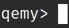

# Qemy: A developer-first CLI toolkit for financial data, modeling, and analytics




Qemy is a modular, open-source financial research toolkit built in Python. It features clean access to financial and economic data, a flexible plugin system for running your own models and analysis, and a built in command-line interface - all in one place.

Project Goal: 

A developer-first alternative to traditional financial platforms - minimalist, hackable, and designed for users who value customization, experimentation, and seamless integration of their own tools.

**Work in Progress**
- Features may change, break, or get replaced as the project evolves.

Suggestions are welcome!

- [Feedback](https://github.com/ryan-rashidian/qemy/discussions/1)
- [Ideas](https://github.com/ryan-rashidian/qemy/discussions/2)
- [Report a Bug / Open an Issue](https://github.com/ryan-rashidian/qemy/issues/new)
- [Development Log](DEVLOG.md)
- [Roadmap](ROADMAP.md)
- [Contribute](CONTRIBUTING.md)

---

## Table of Contents

- [Features](#features)
- [Installation](#installation)
- [Enable Clients](#enable-clients)
- [Usage](#usage)
- [Legal / Attribution](#legal--attribution)
- [License](#license)

---

## Features

- Command-line interface application
- Clients for financial and economic data
- Financial modeling and metric calculation
- PLANNED: Graphing and data visualization
- PLANNED: SDK for creating plugins

---

## Installation 

### Clone the repo:

```bash
git clone https://github.com/ryan-rashidian/qemy.git
```

### Install Qemy

It's recommended to use a Python virtual environment.

Install from project root:

```bash
pip install .
```

[Developer Installation](docs/install.md)

---

## Enable Clients

Clients can be enabled in the CLI using the `env` command. Some functionality and CLI commands will not be available until dependent Clients are enabled.

Clients: SEC EDGAR API, FRED API, Tiingo API

### API Keys and user credentials

Sign up required for FRED API and Tiingo API:

- https://fred.stlouisfed.org/docs/api/fred/
- https://www.tiingo.com/
- https://www.sec.gov/search-filings/edgar-application-programming-interfaces (No sign up or API key required. EDGAR API verifies requests with a "User-Agent" identification alias.)

- Refer to "Usage" below for info related to API usage and data limitations.

IMPORTANT: Read "Legal / Attribution" before using Qemy with any 3rd party API service.

---

## Usage

### Launch CLI

To start the Qemy command-line interface run:

```bash
qemy
```

from any terminal or shell.

### Use CLI

Proper documentation is being planned. For now, refer to the help commands within the CLI for more information.

- This program does not require paying any fees or subscriptions. There are paid subscriptions for Tiingo API available in order to increase data usage limitation. Be mindful of data usage/request limits for all APIs. More info and tracking is available on their websites.

---

## Legal / Attribution

By using the Qemy application, you agree to the Qemy Terms of Use ("Legal / Attribution") below and Licensing terms.

- Users are responsible for complying with the terms of any third-party APIs used.
- Qemy is not affiliated with the SEC or Federal Reserve.
- Qemy does not collect or transmit any user data, personal information, or API usage statistics.
- Data may have errors, delays, or be incomplete.
- 3rd party APIs sign ups must be done through their respective websites. Qemy does not include a automated sign up process for 3rd party APIs.

### SEC EDGAR

- This product uses the SEC EDGAR API but is not endorsed or certified by the U.S. Securities and Exchange Commission.

### Fred API

- This product uses the FRED® API but is not endorsed or certified by the Federal Reserve Bank of St. Louis.

### Tiingo API

- This software integrates with the Tiingo API for stock market data, but does not cache data or redistribute data, API keys or any user data (such as tracking endpoint usage).
- This software is not owned, managed by, or affiliated with/by Tiingo.

---

## License

This project is licensed under the [Apache License 2.0](LICENSE).

Qemy™ is a trademark of Ryan A. Rashidian.
The Qemy name, logo, and related branding are not covered by the open-source license and may not be used without permission.

See the [Notice](NOTICE) file for additional licensing details.

